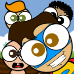
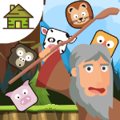
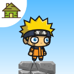

# inks2d <!-- omit in toc -->

[](https://www.npmjs.com/package/inks2d)

[](#installation)

[](https://github.com/inkasadev/inks2d)
[](https://www.codefactor.io/repository/github/inkasadev/inks2d)
[](https://github.com/inkasadev/inks2d/blob/main/LICENSE.md)

inks2d is a free no-dependency Typescript game engine designed for developing 2D games. It provides you with a fast, friendly and clean framework to prototype and develop your games on. This means that most of the hard work is already done, letting you concentrate on the design and testing of your game.

## Table of contents <!-- omit in toc -->
- [Features](#features)
- [Packages](#packages)
- [Installation](#installation)
- [Basic Example](#basic-example)
- [Support and Resources](#support-and-resources)
- [Contributing](#contributing)
- [Showcase](#showcase)
  - [Web](#web)
  - [Android](#android)
- [Authors](#authors)
- [License](#license)

---

## Features

- API inspired in part by Flash's display list, and should be easy to pick up for JS/TS developers.
- All the most important sprites you need: rectangles, circles, triangles, lines, text and image sprites. You can make any of these sprites with only one line of code. You can also create your own custom sprite types.
- Sound effect support with volume, panning, and fading, complete with one-line sound playback.
- Quick and efficient particle effects and emitters for beautiful particle systems without slowing things down.
- Simple keyboard, mouse and touch input state checking makes setting keys and events incredibly easy, yet powerful.
- Universal asset loader to pre-load images, fonts, sounds and JSON data files. All popular file formats are supported. You can load new assets into the game at any time.
- A lot of helper functions for animations, tilemaps, text, backdrops, and more.
- Tree shaking support.

---

## Packages

| Package                                 | Version (click for changelogs)                                                                                                              |
| --------------------------------------- | :------------------------------------------------------------------------------------------------------------------------------------------ |
| [inks2d](packages/inks2d)               | [](packages/lib/CHANGELOG.md)                           |
| [create-inks2d](packages/create-inks2d) | [](packages/create-inks2d/CHANGELOG.md) |

---

## Installation

With NPM:

```bash
$ npm create inks2d@latest
```

With Yarn:

```bash
$ yarn create inks2d
```

With PNPM:

```bash
$ pnpm create inks2d
```

Then follow the prompts!

You can also directly specify the project name and the platform you want to use via additional command line options. For example, to scaffold a inks2d + Web project, run:

```bash
# npm 6.x
npm create inks2d@latest my-inks2d-game --platform web

# npm 7+, extra double-dash is needed:
npm create inks2d@latest my-inks2d-game -- --platform web

# yarn
yarn create inks2d my-inks2d-game --platform web

# pnpm
pnpm create inks2d my-inks2d-game --platform web
```
See [create-inks2d](https://github.com/inkasadev/inks2d/tree/main/packages/create-inks2d) for more details on each supported platform

---

## Basic Example

```js

import { Engine, Scene } from "inks2d";
import { Rectangle } from "inks2d/geom";

const g = new Engine(640, 480);

class Main extends Scene {
  constructor() {
    super();
  }

  async start(e: Engine) {
    super.start(e);

    const rect = new Rectangle(50, 50, "blue");
    rect.position.x = g.stage.width / 2;
    rect.position.y = g.stage.height / 2;
    g.stage.addChild(rect);
  }
}

g.scene = new Main();
g.start();

```

---

## Support and Resources

- Find examples in the [examples folder](https://github.com/inkasadev/inks2d/tree/main/packages/examples).
- Read the [documentation](https://inkasadev.github.io/inks2d/).
- Discuss, share projects, ask technical questions and interact with other users on [Discussions](https://github.com/inkasadev/inks2d/discussions).
- Again, have a look at the included [examples](https://github.com/inkasadev/inks2d/tree/main/packages/examples) and [API documentation](https://inkasadev.github.io/inks2d/) for more in-depth information.

It was built by [Phillipe Martins (aka "Inkasa Dev")](https://github.com/inkasadev), and is released for free under the MIT license, which means you can use it for almost any purpose (including commercial projects). We appreciate credit where possible, but it is not a requirement.

---

## Contributing

Please read
[CONTRIBUTING.md](https://github.com/inkasadev/inks2d/blob/master/.github/CONTRIBUTING.md) for
details on our code of conduct, and the process for submitting pull requests to
us.

---

## Showcase

### Web

|         |        |
| :---------------------------------------------------------: | :------------------------------------------------------: |
| [Pimi Jumpers](https://www.ojogos.com.br/jogo/pimi-jumpers) | [Lolly Balls](https://www.jogos123.net/jogo/lolly-balls) |

### Android

|                      |                              |                                 |                         |
| :------------------------------------------------------------------------------: | :----------------------------------------------------------------------------: | :-------------------------------------------------------------------------: | :---------------------------------------------------------------------------------: |
| [Noah Crush Mania](https://play.google.com/store/apps/details?id=me.inkasa.noah) | [Shinobi Way](https://play.google.com/store/apps/details?id=me.inkasa.shinobi) | [Two Dots](https://play.google.com/store/apps/details?id=me.inkasa.twodots) | [Get the Blacks](https://play.google.com/store/apps/details?id=me.inkasa.getblacks) |

---

## Authors

|  |
| :----------------------------------------------------------------------------: |
|               [Phillipe Martins](https://github.com/inkasadev/)                |

See also the list of
[contributors](https://github.com/inkasadev/inks2d/contributors) who
participated in this project.

---

## License

This project is licensed under the MIT License - see the
[LICENSE.md](LICENSE.md) file for details


