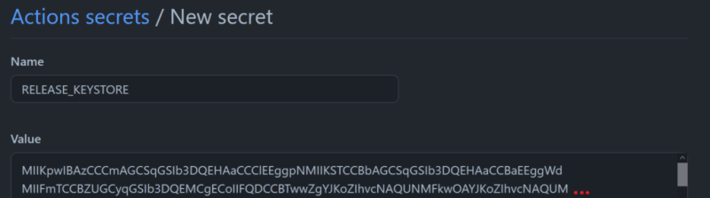
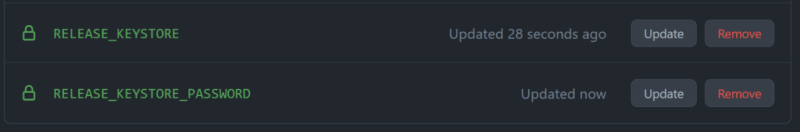
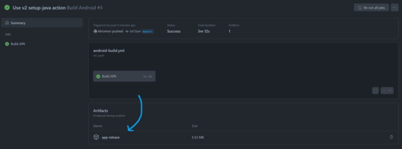

# inks2d Mobile Scaffolding <!-- omit in toc -->

## Table of contents <!-- omit in toc -->
- [Environment Setup](#environment-setup)
- [Create and config your Android project](#create-and-config-your-android-project)
  - [Github Action Workflow](#github-action-workflow)
  - [Generating a key store](#generating-a-key-store)
  - [Adding the key store and password as GitHub Secrets](#adding-the-key-store-and-password-as-github-secrets)
  - [For Windows users](#for-windows-users)
- [Splash Screens and Icons](#splash-screens-and-icons)

## Environment Setup

inks2d uses [Capacitor](https://capacitorjs.com/) to build performant mobile games that run natively on iOS and Android. In order to create games for one or both platforms, you need to install the desired platform-specific dependencies. Please follow the official [Capacitor Environment Setup Guide by clicking here](https://capacitorjs.com/docs/getting-started/environment-setup).

## Create and config your Android project

After the environment setup is configured, you can install the Android platform.

```bash
$ npm run setup:android
```

### Github Action Workflow

> **Disclaimer:** _This session has been deeply based on [this article](https://dev.to/khromov/build-your-capacitor-android-app-bundle-using-github-actions-24do). I'm just reproducing it here to keep this content alive under my umbrella._

This project comes with a Github Action workflow that will produce a signed app bundle, ready for upload to Google Play Console. Follow this to know how to configure it.

At a high level, we will:

- Set up our key store and signing keys
- Adding our key store and signing keys to GitHub Secrets

### Generating a key store

In case you don’t have a key store to sign your app releases, you can generate one with this command:

```bash
$ keytool -genkey -v -keystore inks2d-game.keystore -keyalg RSA -keysize 2048 -validity 10000 -alias release
```

> **Note:** If you change the .keystore filename in this command, please don't forget to also add it with the new filename to .gitignore, so you don't accidentally commit it to your repo. **The keystore should be kept secret**.

### Adding the key store and password as GitHub Secrets

In GitHub we can add secrets for our repository under **Settings > Secrets > Actions**.

We quickly run into a snag however, because secrets can only be strings, and the key store is actually binary data. To convert your .keystore file in a string, you can use websites like [Base64 Guru](https://base64.guru/converter/encode/file).

Now we can add it as a secret named `RELEASE_KEYSTORE`. It should look something like this:



> **Note:** Don't worry about the base64 representation - will convert it back to a file in our GitHub Action.

Let’s also add the key store password as `RELEASE_KEYSTORE_PASSWORD`. Now it should look like this:



After pushing your change you can navigate to the Actions tab in your repo where you should see your build running.

> **Note:** If your build does not finish, please try building locally using the workflow steps above, there might be something wrong with your Capacitor configuration.

Once your build has run successfully, you can download your bundle directly from the build run page!



> **Note:** You might want to tweak some things in the `build-android.yml` file, such as the branch to build `on`, preferred Java version, and how much retention you want for your output artifacts using the `retention-days` configuration option.

From here you can directly upload the signed bundle on the Google Play Console!

> **Note:** Don't forget that you have to bump the versionCode in `android/app/build.gradle` for every new version you intend to upload to the Play store.

### For Windows users

If you are facing the following error:

```
Run ./gradlew build
/home/runner/work/_temp/46af0a17-aff6-47ea-ab02-304aec292273.sh: line 1: ./gradlew: Permission denied
```

It happens because the `gradlew` file did not get added as executable in your repository. To solve it, please run this command:

```bash
git update-index --chmod=+x android/gradlew
```

Then commit and push this change.

## Splash Screens and Icons

This project cames with a easy way for you generate Splash Screens and Icons for your game.

First, provide icon and splash screen source images using this folder/filename structure:

```
resources/
├── icon-only.png
├── icon-foreground.png
├── icon-background.png
├── splash.png
└── splash-dark.png
```

- Icon files should be at least 1024px x 1024px.
- Splash screen files should be at least 2732px x 2732px.
- The format can be jpg or png.

Then generate using the following command:

```bash
$ npm run assets:android
```